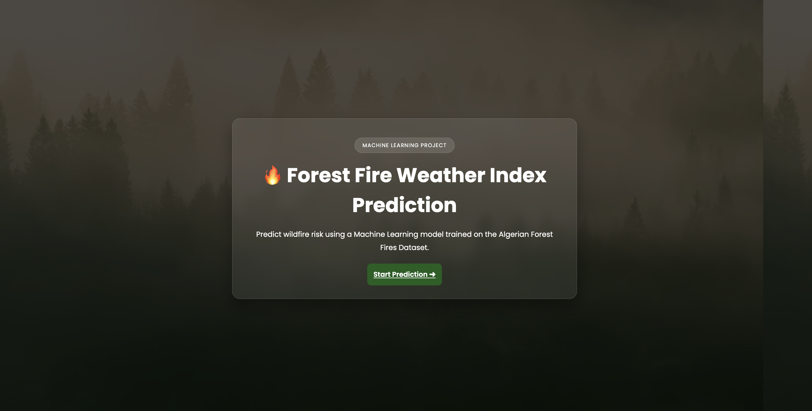
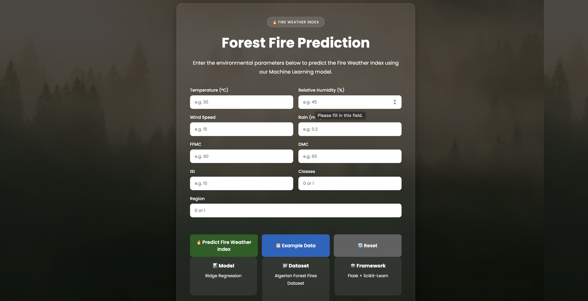

# 🌲 Forest Fire Prediction Web Application

<div align="center">

### 🔥 Machine Learning-powered Forest Fire Weather Index (FWI) Prediction

Predict the **Fire Weather Index (FWI)** using meteorological parameters and receive an intelligent fire risk assessment with safety recommendations.

🌐 **Live Demo:** https://forest-fire-prediction-yf5u.onrender.com/

[](https://www.python.org/)
[](https://flask.palletsprojects.com/)
[](https://scikit-learn.org/)
[](https://render.com/)

</div>

---

# 📖 Overview

Forest fires are among the most destructive natural disasters, causing severe environmental and economic damage every year.

This project leverages **Machine Learning** to predict the **Fire Weather Index (FWI)** using weather and environmental parameters. Users can enter the required values through a clean web interface and instantly receive:

- 🔥 Predicted Fire Weather Index
- 🚨 Fire Risk Level
- 💡 Safety Recommendations

The application is built using **Flask**, powered by **Scikit-learn**, and deployed on **Render**.

---

# 🚀 Live Demo

### 🌐 Website

**https://forest-fire-prediction-yf5u.onrender.com/**

---

# 📸 Application Screenshots

## Home Page



---

## Prediction Result



---

# ✨ Features

- 🌲 Forest Fire Weather Index Prediction
- 📊 Real-time ML Prediction
- 🚨 Intelligent Risk Classification
- 💡 Dynamic Safety Recommendations
- 🎨 Modern Responsive User Interface
- ⚡ Fast Prediction using Pre-trained ML Model
- ☁️ Cloud Deployment using Render

---

# 📊 Risk Categories

| Fire Weather Index | Risk Level |
|-------------------:|------------|
| < 5 | 🟢 Low Fire Risk |
| 5 – 15 | 🟡 Moderate Fire Risk |
| 15 – 30 | 🟠 High Fire Risk |
| > 30 | 🔴 Extreme Fire Risk |

---

# 🛠 Tech Stack

## Machine Learning

- Python
- Scikit-learn
- NumPy
- Pandas
- Seaborn

## Backend

- Flask

## Frontend

- HTML5
- CSS3
- Jinja2

## Deployment

- GitHub
- Render

---

# 📂 Project Structure

```
Forest-Fire-Prediction/
│
├── dataset/
├── models/
│   ├── ridge.pkl
│   └── scaler.pkl
│
├── notebooks/
│
├── screenshots/
│   ├── home.png
│   └── result.png
│
├── static/
│   ├── style.css
│   └── forest-bg.jpg
│
├── templates/
│   └── index.html
│
├── app.py
├── requirements.txt
├── README.md
└── .gitignore
```

---

# 📥 Input Features

The model predicts the Fire Weather Index using the following weather parameters:

- 🌡 Temperature
- 💧 Relative Humidity (RH)
- 🌬 Wind Speed (Ws)
- 🌧 Rain
- 🌿 Fine Fuel Moisture Code (FFMC)
- 🌲 Duff Moisture Code (DMC)
- 🔥 Initial Spread Index (ISI)
- 🏞 Region
- 📌 Classes

---

# ⚙️ Installation

## Clone Repository

```bash
git clone https://github.com/SanskarCodes/Forest-Fire-Prediction.git

cd Forest-Fire-Prediction
```

---

## Create Virtual Environment

### Windows

```bash
python -m venv venv

venv\Scripts\activate
```

### macOS / Linux

```bash
python3 -m venv venv

source venv/bin/activate
```

---

## Install Dependencies

```bash
pip install -r requirements.txt
```

---

## Run the Application

```bash
python app.py
```

Open your browser:

```
http://127.0.0.1:5000
```

---

# 🧠 Machine Learning Workflow

- Data Collection
- Data Cleaning
- Exploratory Data Analysis (EDA)
- Feature Engineering
- Feature Scaling
- Model Training
- Model Evaluation
- Model Serialization
- Flask Integration
- Cloud Deployment

---

# 📈 Sample Prediction

```
Predicted Fire Weather Index

21.47

Risk Level

🟠 High Fire Risk

Recommendation

High possibility of wildfire spread.
Outdoor burning is strongly discouraged.
```

---

# 📚 Dataset

This project is based on the **Algerian Forest Fires Dataset**, which contains meteorological observations and fire weather indices from two regions in Algeria. The dataset is commonly used for regression and classification tasks in machine learning related to wildfire prediction.  [oai_citation:0‡GitHub](https://github.com/ashishrana1501/Forest-Fire-Prediction?utm_source=chatgpt.com)

---

# 🚀 Deployment

The application is successfully deployed on **Render**.

### Live Website

https://forest-fire-prediction-yf5u.onrender.com/

---

# 🔮 Future Improvements

- Weather API Integration
- Real-time Prediction
- Docker Support
- AWS Deployment
- Prediction History
- User Authentication
- Interactive Dashboards
- Mobile-first UI Improvements

---

# 🤝 Contributing

Contributions are welcome!

If you'd like to improve this project:

1. Fork the repository.
2. Create a new feature branch.
3. Commit your changes.
4. Open a Pull Request.

---

# 👨‍💻 Author

## Sanskar Gupta

🎓 B.Tech in Data Science & Artificial Intelligence (TIET)

- 💼 LinkedIn: https://www.linkedin.com/in/codesanskar/
- 💻 GitHub: https://github.com/SanskarCodes

---

# ⭐ Show Your Support

If you found this project useful, please consider giving it a ⭐ on GitHub.

It motivates me to build more Machine Learning and AI projects.

---

<div align="center">

### ⭐ Thanks for visiting this repository! ⭐

**Happy Coding 🚀**

</div>
